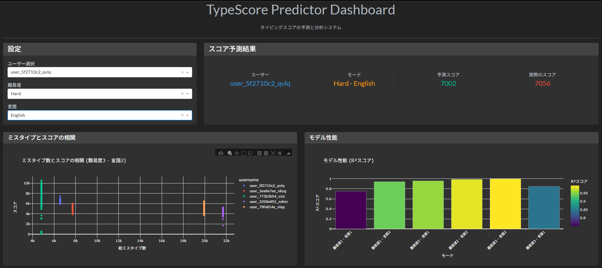

# TypeScore Predictor

タイピングスコア予測システム



## 概要

このプロジェクトは、過去のタイピングセッションデータから次のセッションのスコアを予測する機械学習システムです。

## 機能

1. **データ準備とクリーニング**: 3つのCSVファイルを結合し、セッション単位の統一データセットを作成
2. **特徴量エンジニアリング**: 過去のパフォーマンスを示す時系列特徴量を作成
3. **モデル学習と評価**: RandomForest回帰モデルで学習し、R²/MSEで評価
4. **リアルタイム可視化**: インタラクティブなダッシュボードでの結果表示
5. **システム監視**: システム状態とモデル性能の監視機能

## アーキテクチャ

```
app/
├── config.py          # 設定管理
├── logger.py          # ログ機能
├── data_loader.py     # データ読み込み（最適化済み）
├── preprocessor.py    # データ前処理（最適化済み）
├── model_trainer.py   # モデル訓練（並列処理対応）
├── visualizer.py      # 可視化（キャッシュ対応）
└── main.py           # メインアプリケーション
```

## 評価指標

- **R² (決定係数)**: モデルの説明力（0-1の範囲）
- **MSE (平均二乗誤差)**: 予測誤差の平均
- **並列処理性能**: 複数モデルの同時訓練
- **メモリ効率**: 最適化されたデータ型の使用

## 技術スタック

- **Python 3.11**: メイン言語
- **Pandas**: データ処理とメモリ最適化
- **Scikit-learn**: 機械学習ライブラリ（並列処理対応）
- **Plotly**: インタラクティブ可視化
- **Dash**: Webダッシュボード
- **Docker**: 環境構築とデプロイ
- **ThreadPoolExecutor**: 並列処理

## ライセンス

このプロジェクトはMITライセンスの下で公開されています。
